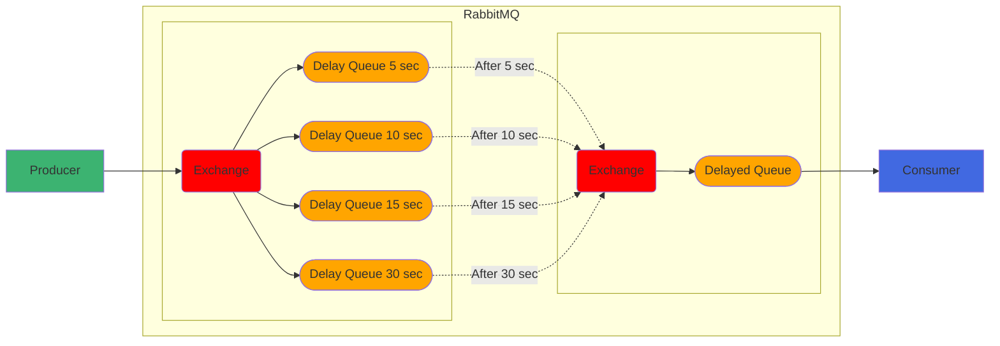

# MessageDelay #

MessageDelay is a solution wrote in Kotlin on the top of RabbitMQ that makes possible delay the message delivery for a 
predefined period.

## How to run the project ##

You need a RabbitMQ cluster on a minimal version 3.10. In case you don’t have a cluster available, you can use the 
docker-compose present on the project inside the docker folder.

### Run using docker compose ###

Navigate to folder haproxy (../docker/haproxy) and build the haproxy image

```docker
docker build -t rabbit-haproxy .
```

After building the haproxy execute the *‘start_all.sh’*. This script will start with the docker-compose with 4 instances
of RabbitMQ and put it in a cluster mode.

```bash
 sh start_all.sh
```

### Run locally ###

On the root of the project you can run the main class ‘*MessageDelayApplication.kt*‘

or run using the gradle task bootRun with the command.

```gradle
./gradlew bootRun
```

## How to use the project ##

The work flow is pretty simple, basically we produce the message on a queue which has a predefined delay.
Using the message-ttl feature on quorum queues (that was release on Rabbit 3.10) I was able to create some predefined 
queues that holds (delay) the message delivery for a period and them these messages are send to a DLQ (DELAYED_QUEUE),
where a consumed is bind to it, so the messages that "expires" aka wait the predefined period will be ready to be consumed.


> **_NOTE:_** RabbitMQ message ttl is only executed o the messages that are in the head of the queue so this is why I 
> use multiple queues where each one handle a specific delay period.

The project has an endpoint where you can use to send message to the delay queues these endpoint will send a random 
message to be delayed for 5,10,15,30 seconds consecutively.
> localhost:8080/delay/5 </br>
> localhost:8080/delay/10 </br>
> localhost:8080/delay/15 </br>
> localhost:8080/delay/30 </br>

#### Important links ####
* [RabbitMQ TTL](https://www.rabbitmq.com/ttl.html) 
* [RabbitMQ Quorum Queues](https://www.rabbitmq.com/quorum-queues.html)
* [RabbitMQ Reactor](https://projectreactor.io/docs/rabbitmq/snapshot/reference/)
* [Project Reactor](https://projectreactor.io/)
* [Kotlin](https://kotlinlang.org/)
* [Gradle](https://gradle.org/)
